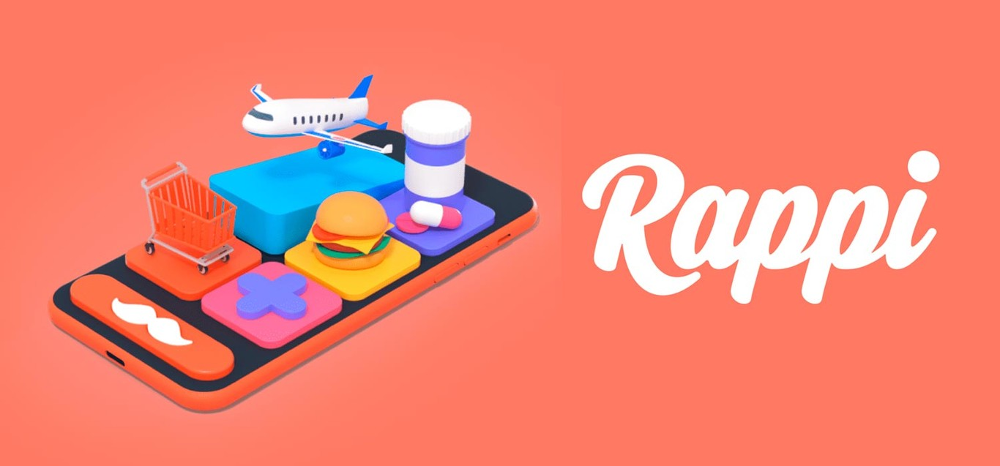

# Rappi Campus

### Integrantes

* Jose Daniel Nova Muñoz

* Ludwing Santiago Villamizar Murillo

* Juan Diego Ramirez Mogotocoro

## Investigacion sobre rappi

El modelo de negocio de Rappi se basa en una plataforma tecnológica que conecta a usuarios con una amplia variedad de servicios y productos a través de su aplicación móvil y plataforma web. Su enfoque principal es la entrega a domicilio, donde los usuarios pueden solicitar alimentos de restaurantes locales, compras de supermercado, productos de farmacia y más. Mediante una red de repartidores conocidos como "Rappitenderos", Rappi recoge los productos de comercios asociados y los entrega directamente en las ubicaciones de los usuarios. Además, Rappi ha diversificado su oferta para incluir servicios como envío de paquetes, trámites bancarios y más, aumentando su utilidad en diferentes contextos. Su colaboración con una variedad de establecimientos comerciales y su enfoque en la innovación constante son pilares fundamentales de su modelo, permitiéndoles proporcionar soluciones convenientes y rápidas a través de pagos digitales y una experiencia de usuario simplificada.

### Pilares Fundamentales de Rappi que se usaran en el proyecto

1. Entrega a Domicilio

Rappi se basa en una red de repartidores, conocidos como Rappitenderos, que desempeñan un papel crucial en la plataforma. Estos repartidores recogen los productos solicitados por los usuarios y los entregan directamente en sus hogares u oficinas. La entrega rápida y eficiente es esencial para la experiencia de usuario de Rappi.

2. Variedad de Servicios

Además de la entrega de alimentos, Rappi ha diversificado su oferta para incluir una amplia gama de servicios. Esto abarca desde compras de supermercado y farmacia hasta entrega de alcohol y envío de paquetes. La variedad de servicios disponibles amplía la utilidad de la plataforma para los usuarios.

3. Colaboración con Comercios

Rappi establece colaboraciones estratégicas con diversos establecimientos comerciales, tales como restaurantes, supermercados y tiendas. Esta colaboración permite a Rappi ofrecer un catálogo extenso de productos y servicios. Los usuarios pueden elegir entre una amplia gama de opciones gracias a estas asociaciones.